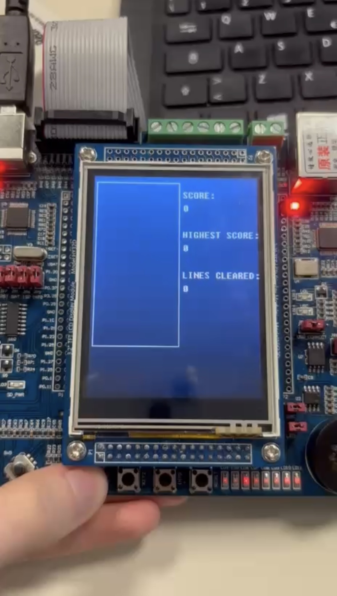
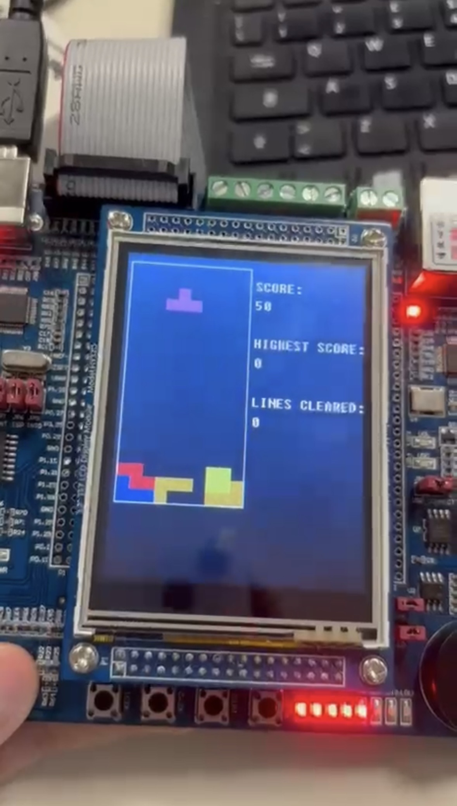

# Tetris on LandTiger LPC1768

A bare-metal implementation of the Tetris game in C for the LandTiger development board, based on the NXP LPC1768 ARM Cortex-M3 microcontroller. The game runs directly on the microcontroller and uses the board's GLCD, joystick, buttons, timers and DAC. The project includes the game logic, rendering, user input, timing and sound.

## Main features

- 10×20 playing field
- Full Tetris ruleset: 7 tetromino shapes (I, O, T, J, L, S, Z), with 4 rotation states each
- Piece movement with collision detection
- Soft drop (2 squares/sec while held) and hard drop (instant fall)
- Line clearing with row shifting and score computation (single/multi-line/tetris bonus)
- Score, highest score (persisted across games within a session) and number of cleared lines displayed during the game
- Pause and resume
- Game-over detection
- Random generation of tetrominoes
- Real-time rendering on the GLCD
- Background music (Tetris theme, simplified) and 6 distinct sound effects (move, rotate, line clear, tetris, hard drop, game over), generated via DAC direct digital synthesis (sine lookup table)
- Fully interrupt-driven architecture: no polling in the main loop

## Controls

| Input | Action |
|---|---|
| KEY1 | Start game / toggle pause |
| KEY2 | Hard drop |
| Joystick left/right | Move piece |
| Joystick up | Rotate piece 90° clockwise |
| Joystick down (hold) | Soft drop |

## Tech stack

| Layer | Technology |
|---|---|
| Language | C |
| Microcontroller | NXP LPC1768 – ARM Cortex-M3 |
| Board | LandTiger |
| IDE / Toolchain | Keil µVision (MDK-ARM) |
| Peripherals | GPIO (joystick, buttons), External Interrupts (EINT), Repetitive Interrupt Timer (RIT), Timer0, Timer2, Timer3, DAC, GLCD |
| Emulation | Keil µVision LandTiger simulator |

## Photos

## Run in Keil µVision

1. Open `sample.uvprojx` with Keil µVision.
2. Select the "SW_Debug" compilation target to run on the LandTiger emulator (or the release target if using a physical board).
3. Build the project and start a debug session.
